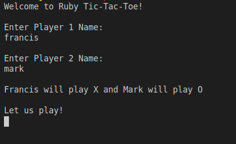
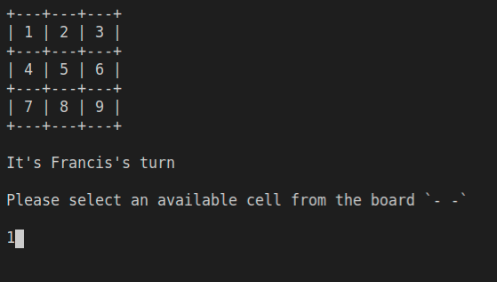
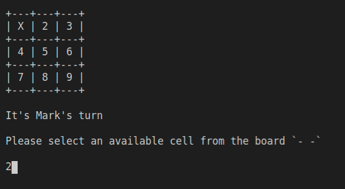
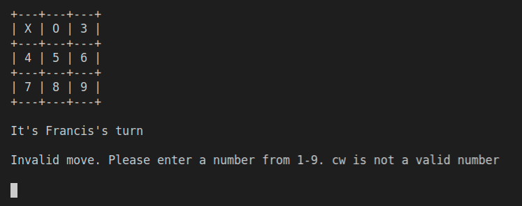
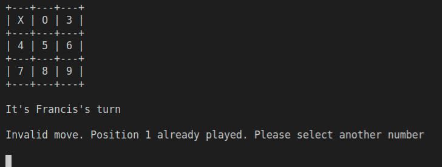
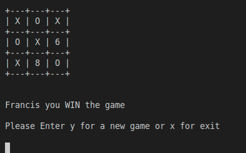

# tic-tac-toe
A tic tac toe game implemented using OOP best practices and a DRY approach in Ruby.


## About
Tic-tac-toe, noughts and crosses, or Xs and Os/“X’y O’sies”, is a paper-and-pencil game for two players, X and O, who take turns marking the spaces in a 3×3 grid. The player who succeeds in placing three of their marks in a diagonal, horizontal, or vertical row is the winner. [Wikipedia](https://en.wikipedia.org/wiki/Tic-tac-toe#:~:text=Tic%2Dtac%2Dtoe%20)


## Built With
- Ruby

### Prerequisites
- A computer with ruby installed.

### Install
- gem install rubocop
- to check that code is passing all rubocop checks, run the following command after editing
```
rubocop --color
```

### Usage
- git clone this [repo](https://github.com/KabohaJeanMark/tic-tac-toe/) to your local machine and navigate (cd ) to the top directory containing the main.rb file
- run the following command
```
bin/main.rb
```
Welcome runs on terminal to get player names and designate tokens



Choose a valid number from 1 to 9 (asking player 1). For example player 1 selects 1 and it turns into an X. See next image step how 1 is X.




Next player's turn (player 2)



What happens if an invalid number is chosen?

If a person selects a wrong input such as 11, 12 or a string like "cw1" the following message returns.



If a person selects a cell which has already been used to place in X or O, for example, 1, the following message is displayed.



WIN



TIE


GAME OVER


When the game has ended a person can either choose to continue by pressing 'y' on their keyboard or opt out by placing 'x'.
Whether you use a lowercase or uppercase 'x' or 'y', it doesn't matter. The commands will be executed.

## Authors

👤 **Kaboha Jean Mark**

- GitHub: [@githubhandle](https://github.com/KabohaJeanMark)
- Twitter: [@jean_quintus](https://twitter.com/jean_quintus)
- LinkedIn: [LinkedIn](https://www.linkedin.com/in/jean-mark-kaboha-software-engineer/)

👤 **Francis Obeta**

- GitHub: [@githubhandle](https://github.com/chasscepts)
- Twitter: [@ofChass](https://twitter.com/ofChass)
- LinkedIn: [LinkedIn](https://www.linkedin.com/in/francis-obetta-4033b71bb/) 

## 🤝 Contributing

Contributions, issues, and feature requests are welcome!

Feel free to check the [issues page](https://github.com/KabohaJeanMark/tic-tac-toe/issues).

## Show your support

Give a ⭐️ if you like this project!

## Acknowledgments

- Hat tip to Microverse and the Odin project.

## 📝 License

This project is [MIT](./LICENSE) licensed.
